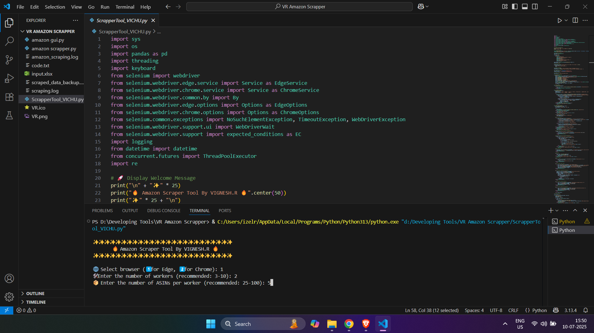

# 🛒 Amazon Product Data Scraper

This project is a powerful **Amazon product data scraper** built for automation purposes using browser simulation and Excel integration.  
It helps extract product information by providing a list of ASINs (Amazon product codes) and outputs all the data into a structured Excel file.

> ⚠️ **Note**: This repository does not contain the actual scraping code to prevent misuse. Only project structure, input/output samples, and a working explanation are provided.

---

## 📂 Folder Structure

Amazon-Data-Scrapper/

│

├── screenshots/ # Screenshots showing the tool in action

├── sample_input.xlsx # Excel file with ASINs to scrape

├── sample_output.xlsx # Final output file after scraping

├── LICENSE # Terms of use

├── README.md # This documentation file

└── (code files not included) # If you want contact me.

---

## 🧠 How the Tool Works

1. You start with an **Excel file** containing a list of product ASINs under the column named `ProductASIN`.
2. Launch the scraper tool (GUI).
3. You choose:
   - Number of browser instances (parallel scraping)
   - How many ASINs each browser should handle
4. The tool opens browser windows and scrapes Amazon for:
   - Title
   - Price
   - Rating
   - Number of Reviews
   - Product Description
   - Availability
   - Seller Name
   - Evey details of the product will scrapped dynamically 
5. Once scraping is completed, the results are saved in a **clean Excel file**.

---

## 📸 Screenshots

| Input Excel File            | Tool GUI                        | Output Excel File              |
|----------------------------|----------------------------------|-------------------------------|
|  |  |  |

---

## 📁 Sample Files

- [`sample_input.xlsx`](./input_sample/sample_input.xlsx): Contains ASINs under the `ProductASIN` column.
- [`sample_output.xlsx`](./output_sample/sample_output.csv): Example output of the scraper in Excel format.

---

## ⚖️ License

This project is protected under custom terms.  
The source code is not shared publicly to avoid scraping misuse.

See [`LICENSE`](./LICENSE.txt) for more information.

---

## 📬 Contact

If you're interested in automation tools or freelance scraping projects, feel free to connect:

- **Name**: Vignesh R
- **GitHub**: [Vichu-R](https://github.com/Vichu-R/Vignesh-R)
- **Email**: [vignesh.rajeshkumar2003@gmail.com]
